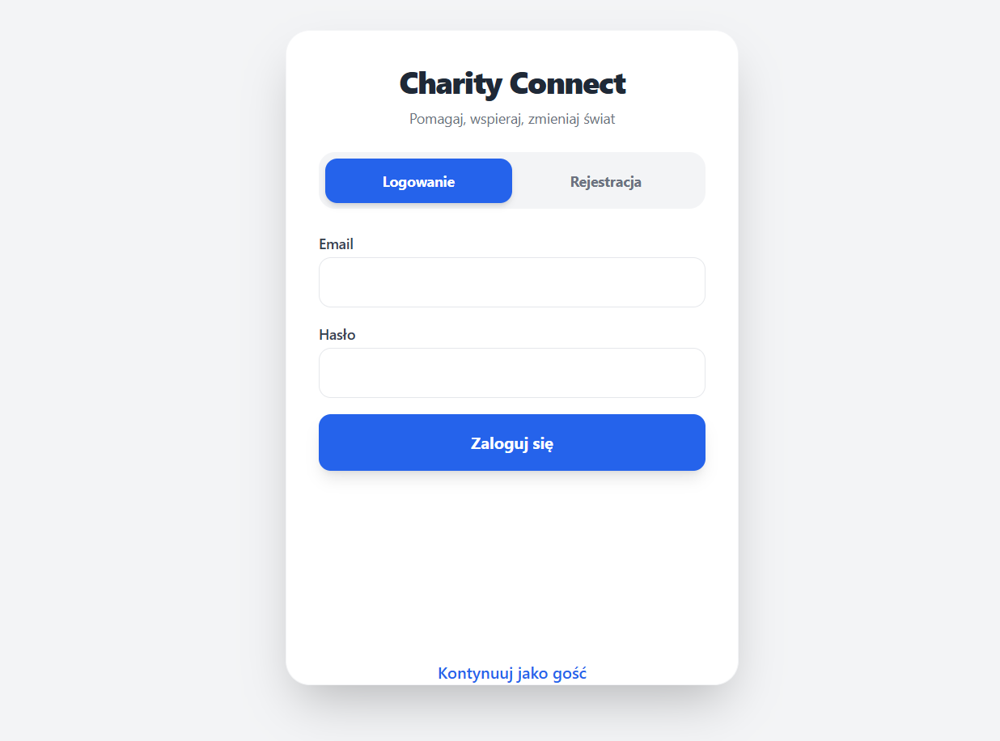
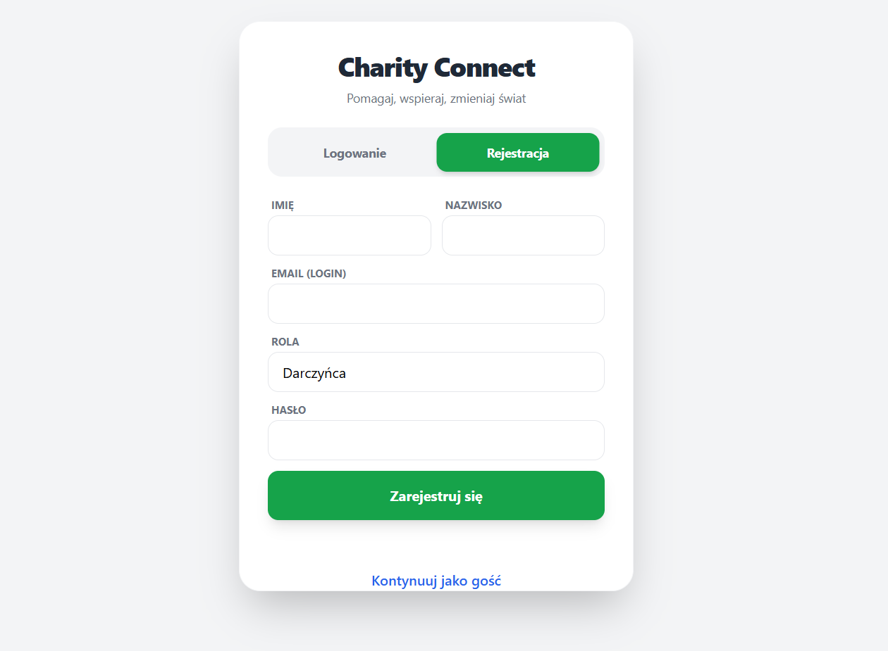
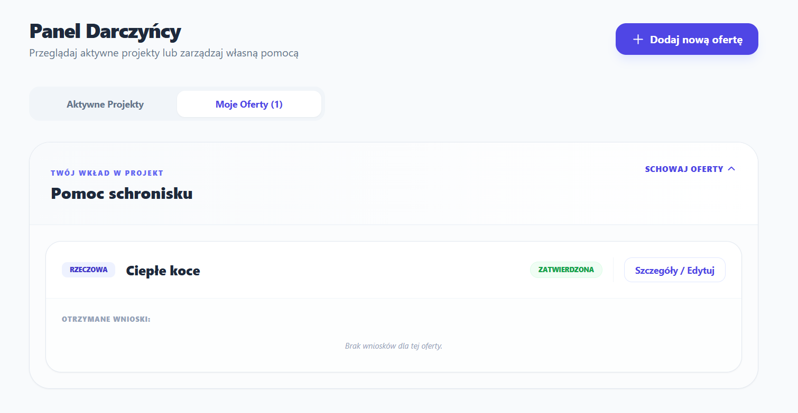
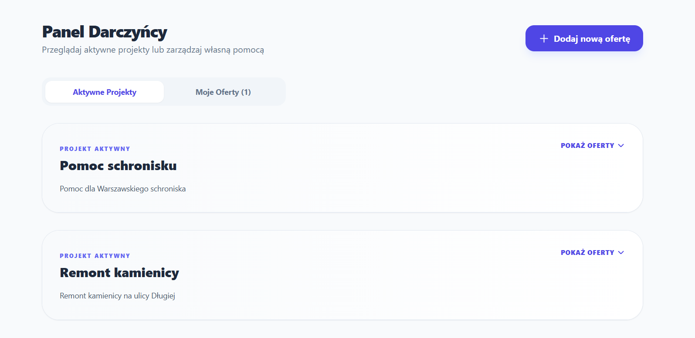
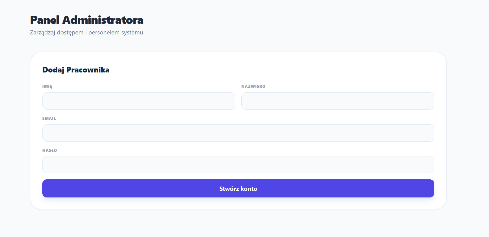
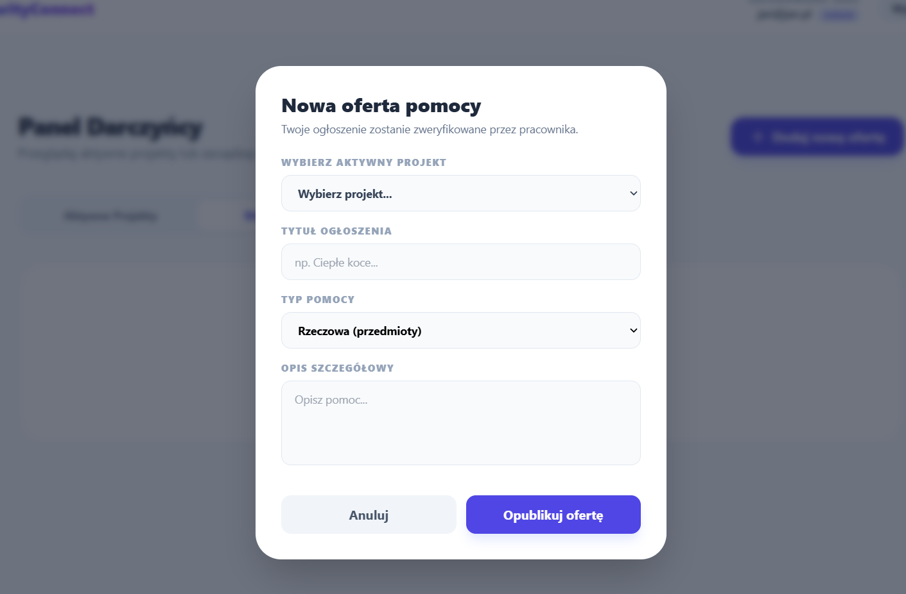

---

# Charity Connect


Charity Connect is a role-based charity management web application built with Flask.
It connects donors, beneficiaries, organization workers, and administrators within a structured project workflow.

---

## Overview

The platform allows:

* Donors to create and manage charity offers
* Beneficiaries to apply for assistance
* Workers to moderate users and manage projects
* Administrators to manage worker accounts
* Guests to browse public content and send inquiries

The application enforces role-based permissions and structured moderation.

---

## Preview













---

## Architecture

* Backend: Flask
* Database: PostgreSQL
* ORM: Flask-SQLAlchemy
* Authentication: Flask-Login
* Frontend: Jinja2 + TailwindCSS

---

## Core Features

### Role-Based Access Control

| Role          | Permissions                                     |
| ------------- | ----------------------------------------------- |
| Administrator | Create workers, system oversight                |
| Worker        | Manage projects, approve offers, moderate users |
| Donor         | Create/edit/delete offers                       |
| Beneficiary   | Apply for offers                                |
| Guest         | Browse offers & projects, send inquiries        |

---

### Project Management

Workers can:

* Create new projects
* Edit projects
* Finish projects (automatically closes related offers)
* Rate collaboration after project completion

---

### Offer Workflow

1. Donor creates offer → status: `pending`
2. Worker approves → status: `approved`
3. Beneficiary applies
4. Donor accepts → offer becomes `closed`

---

### Inquiry System

Guests can send inquiries to the organization.
Workers can review received inquiries in their panel.

---

## Installation

### 1. Clone repository

```bash
git clone https://github.com/your-username/charity-connect-rbac.git
cd charity-connect
```

### 2. Create virtual environment

```bash
python -m venv .venv
source .venv/bin/activate      # macOS / Linux
.venv\Scripts\activate         # Windows
```

### 3. Install dependencies

```bash
pip install -r requirements.txt
```

---

## Environment Configuration

Create a `.env` file in the root directory:

```
SECRET_KEY=your_secret_key
DATABASE_URL=your_postgresql_connection_string
```

Add `.env` to `.gitignore`:

```
.env
```

The application loads configuration via `python-dotenv`.

---

## Database Setup

Ensure PostgreSQL is running and accessible.

Then start the application:

```bash
python run.py
```

Database tables will be created automatically on first run.

---

## Default Administrator

The system automatically creates a default administrator on first launch:

Email:

```
admin@charity.pl
```

Password:

```
admin123
```

Change credentials in `run.py` before production deployment.

---

## Project Structure

```
charity-connect/
│
├── project/
│   ├── __init__.py
│   ├── models.py
│   ├── main.py
│   ├── auth.py
│   └── templates/
│
├── run.py
├── requirements.txt
└── README.md
```

---

## Security Notes

* Do not store database credentials in source code.
* Use environment variables.
* Disable debug mode in production.
* Rotate default admin credentials before deployment.

---

## Future Improvements

* REST API endpoints
* Pagination & filtering
* Email notifications
* Docker containerization
* Deployment automation
* Unit and integration tests


